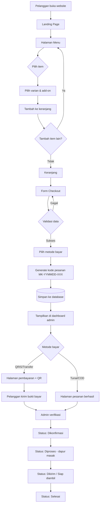

# 04 — Business Flow

Dokumen ini menjelaskan alur end-to-end dari pelanggan membuka website sampai
pesanan selesai diproses admin.

---

## 4.1 Alur utama (happy path)

```
[1] Pelanggan buka website
        ↓  (link dari bio Instagram / status WhatsApp / QR di booth)
[2] Landing page → lihat highlight menu
        ↓
[3] Halaman Menu → pilih kategori (Taichan / Minuman / ChocoBerry)
        ↓
[4] Pilih item → pilih varian (Small/Medium) → pilih add-on → atur jumlah
        ↓
[5] Tambah ke Keranjang  ────────┐
        ↓                        │ (bisa balik ke [3] untuk tambah item lain)
[6] Buka Keranjang ←───────────┘
        ↓  cek rincian & total
[7] Checkout → isi data (nama, WA, tipe order, alamat, waktu, catatan)
        ↓
[8] Pilih metode pembayaran (QRIS / Transfer / Tunai-COD)
        ↓
[9] Sistem buat kode pesanan  MK-YYMMDD-XXX
        ↓
[10] Simpan pesanan ke database (Fase 2)
        ↓
[11] Pesanan masuk ke dashboard admin tanpa membuka WhatsApp
        ↓
[12] Halaman "Pesanan Berhasil" + instruksi pembayaran
        ↓
[13] Pelanggan bayar QRIS → kirim bukti ke WhatsApp
        ↓
[14] Admin verifikasi → ubah status "Dikonfirmasi"
        ↓
[14a] Invoice dengan total final tersedia untuk pelanggan/admin
        ↓
[15] Dapur memasak → status "Diproses"
        ↓
[16] Kurir antar / pelanggan ambil → status "Dikirim"
        ↓
[17] Pesanan diterima → status "Selesai"
```

---

## 4.2 Diagram alur (Mermaid)



---

## 4.3 Status pesanan (state machine)

| Status | Kode | Pemicu | Aksi berikutnya |
|---|---|---|---|
| Baru | `BARU` | Checkout selesai | Admin verifikasi pembayaran (pelanggan bisa menandai "sudah bayar" — lihat catatan klaim di bawah) |
| Dikonfirmasi | `DIKONFIRMASI` | Pembayaran terverifikasi / COD disetujui | Kirim ke dapur |
| Diproses | `DIPROSES` | Dapur mulai memasak | Siapkan pengiriman |
| Dikirim | `DIKIRIM` | Kurir berangkat / pesanan siap diambil | Tunggu konfirmasi terima |
| Selesai | `SELESAI` | Pelanggan menerima pesanan | — |
| Batal | `BATAL` | Dibatalkan pelanggan/admin | — |

**Transisi yang diperbolehkan**

Untuk QRIS/transfer, setiap transisi dari `BARU` ke status maju (termasuk
lompatan langsung) baru boleh dilakukan setelah pelanggan mengirim klaim
"sudah bayar" atau bukti. Request juga wajib disertai acknowledgement admin
bahwa mutasi rekening atau bukti sudah diperiksa dan nominalnya sama dengan
total server. Klaim pelanggan sendiri tidak pernah dianggap sebagai verifikasi.

Alur normal pesanan berurutan satu arah:

```
BARU → DIKONFIRMASI → DIPROSES → DIKIRIM → SELESAI
```

Aturan transisi (berlaku untuk perubahan status oleh admin):

1. Admin boleh **lompat maju** ke status mana pun setelah status saat ini
   (mis. `BARU → SELESAI` langsung) tanpa harus maju satu per satu.
2. Admin boleh membatalkan pesanan (`→ BATAL`) selama status belum final.
3. Transisi **mundur** dilarang, dan status tidak bisa tetap di posisi yang sama.
4. `SELESAI` dan `BATAL` bersifat **final** — tidak bisa berubah lagi.

> Aturan BR-07: setelah status `DIPROSES`, pesanan **tidak bisa dibatalkan
> oleh pelanggan**. Larangan ini tidak berlaku untuk pembatalan oleh admin
> (override manual), karena omzet hanya dihitung dari pesanan `SELESAI`.

**Klaim pembayaran pelanggan (bukan status)**

Di `/pembayaran/[kode]` pelanggan menekan "Saya Sudah Bayar & Kirim Bukti".
Aksi itu **tidak mengubah status pesanan** — hanya mencatat
`payment_claimed_at` (lihat §10.3) lalu halaman menampilkan keadaan
"menunggu konfirmasi admin".

Alasan pemisahan: pembayaran hanya sah setelah admin melihat mutasi/bukti,
jadi pelanggan tidak boleh menggerakkan state machine sendiri. Efeknya:

| Sisi | Tampilan |
|---|---|
| Pelanggan | Loader "Menunggu konfirmasi admin" di halaman pembayaran & banner di `/pesanan/[kode]` selama status masih `BARU` |
| Admin | Badge "Klaim sudah bayar" di daftar pesanan + waktu klaim di detail pesanan, sebagai antrean verifikasi |

Setelah admin memverifikasi, status berpindah `BARU → DIKONFIRMASI` seperti
biasa dan penanda klaim berhenti tampil di sisi pelanggan.

**Invoice**

- Invoice memakai kode pesanan sebagai nomor dokumen dan tersedia mulai status
  `DIKONFIRMASI` hingga `SELESAI`.
- Status `BARU` belum menerbitkan invoice karena total/pembayaran masih dapat
  menunggu verifikasi. Pesanan `BATAL` tidak menerbitkan invoice.
- Pesanan non-tunai yang sudah dikonfirmasi boleh menampilkan "Pembayaran sudah
  dikonfirmasi admin". Pesanan Tunai/COD tidak boleh diberi label "Lunas"
  tanpa data verifikasi pembayaran khusus.

---

## 4.4 Alur alternatif & penanganan error

| Skenario | Penanganan |
|---|---|
| Keranjang kosong saat buka `/checkout` | Redirect ke `/menu` + pesan "Keranjang masih kosong" |
| Toko sedang tutup | Banner "Sedang Tutup" + checkout berubah jadi **Pre-order besok** |
| Menu habis saat masih di keranjang | Saat checkout, tampilkan peringatan & minta hapus item tersebut |
| Nomor WhatsApp tidak valid | Tampilkan error inline, blokir submit |
| Pelanggan ingin menghubungi admin | Sediakan tombol WhatsApp eksplisit dari halaman pesanan/pembayaran; checkout tidak membuka WhatsApp otomatis |
| Tautan pelacakan/pembayaran kehilangan `?token=` | 404 khusus rute pesanan: pulihkan otomatis dari riwayat pesanan di perangkat (`localStorage`) → redirect ke tautan utuh; bila tidak ada, tampilkan pesanan terakhir di perangkat + tombol chat admin bawa kode pesanan |
| Respons checkout hilang setelah pesanan tersimpan | Browser mengulang payload dengan `Idempotency-Key` yang sama; server mengembalikan pesanan pertama, bukan membuat duplikat |
| Halaman "Pesanan Saya" dibuka kembali | Maksimal 10 entri lokal disinkronkan ke server sehingga status dan total terbaru menggantikan snapshot lama; entri 404 dibuang |
| Perangkat/browser dipakai orang lain | Riwayat guest memang mengikuti profil browser, bukan identitas orang. Tampilkan peringatan + tombol **Hapus Riwayat** dua langkah; hapus otomatis setelah 30 hari. Profil/incognito/perangkat berbeda tidak berbagi riwayat |
| Pelanggan tidak bayar dalam 60 menit | Admin ubah status jadi `BATAL` (manual di Fase 2) |
| Alamat di luar jangkauan antar | Admin konfirmasi lewat WhatsApp & tawarkan ambil sendiri |
| Website error saat submit | Simpan keranjang di `localStorage`, tampilkan tombol coba lagi |

---

## 4.5 Alur sisi admin

```
Pesanan baru masuk ke dashboard admin
        ↓
Buka /admin (login)
        ↓
Daftar pesanan (default filter: hari ini, status BARU)
        ↓
Buka detail pesanan → cek bukti bayar
        ↓
├─ Valid   → tombol "Konfirmasi"  → status DIKONFIRMASI
└─ Tidak   → tombol "Batalkan"    → status BATAL + hubungi pelanggan
        ↓
Cetak / catat ke dapur → status DIPROSES
        ↓
Serahkan ke kurir      → status DIKIRIM
        ↓
Pelanggan terima       → status SELESAI
        ↓
Akhir hari: buka Rekap Harian → jumlah pesanan + omzet
```

---

## 4.6 Format pesan WhatsApp (template resmi)

```
🍽️ *PESANAN BARU — MAU'S KITCHEN*
Kode Pesanan: *MK-260814-001*
📅 14 Agustus 2026, 19.45 WIB

👤 *DATA PEMESAN*
Nama    : Rizky
WhatsApp: 081234567890
Tipe    : Antar
Alamat  : Jl. Melati No. 12, RT 03/RW 05
Waktu   : Secepatnya

🛒 *RINCIAN PESANAN*
1. Taichan Daging
   2 porsi × Rp35.000 = Rp70.000
2. Choco Berry Grape (Medium)
   + Pistacio Kunava
   1 cup × Rp48.000 = Rp48.000
3. Thai Tea
   2 cup × Rp17.000 = Rp34.000
4. Lontong
   1 porsi × Rp5.000 = Rp5.000

Subtotal : Rp157.000
Ongkir   : dikonfirmasi admin
*TOTAL SEMENTARA   : Rp157.000*

💳 *PEMBAYARAN*
Metode: QRIS (DANA / BCA / GoPay)
Status: Menunggu ongkir sebelum pembayaran

📝 *CATATAN*
Sambelnya pisah ya, jangan terlalu pedas

— Dikirim otomatis dari website MAU'S Kitchen
```

> Detail teknis encoding dan pembuatan deeplink ada di `13_WHATSAPP_INTEGRATION.md`.

---

## 4.7 Kontrak ongkir dan pembayaran

1. Checkout **Ambil Sendiri** menyimpan `delivery_fee = 0`; total langsung final.
2. Checkout **Antar** menyimpan `delivery_fee`, `delivery_provider`, dan
   `courier_cost` sebagai `null`; angka yang terlihat masih subtotal sementara.
3. Admin memilih pengantaran internal, GoSend, GrabExpress, atau kurir lain;
   lalu menyimpan ongkir pelanggan dan biaya kurir aktual dalam satu aksi.
4. Sistem menghitung `total = subtotal + delivery_fee` di server. Selisih
   `delivery_fee - courier_cost` hanya untuk laporan internal admin.
5. QRIS/transfer, klaim bayar, dan upload bukti baru aktif setelah rencana
   pengantaran dan total lengkap.
6. Admin tidak dapat mengubah status Antar ke `DIKONFIRMASI` sebelum pengantar,
   ongkir pelanggan, dan biaya kurir aktual lengkap.
7. Tunai/COD untuk Antar hanya boleh memakai `delivery_provider = internal`.
   Kurir eksternal biasa tidak dianggap sebagai penagih harga makanan.
8. Pengantar dan biaya tidak dapat diubah setelah pelanggan mengklaim pembayaran,
   mengunggah bukti, atau status pesanan sudah dikonfirmasi.
9. Rp0 adalah ongkir final yang sah; perubahan `null → 0` tetap harus
   menyegarkan halaman pelanggan.

---

## 4.8 SLA internal (target waktu)

| Tahap | Target waktu |
|---|---|
| Balas pesanan masuk | ≤ 5 menit (jam operasional) |
| Verifikasi pembayaran | ≤ 10 menit |
| Memasak Taichan | 15–20 menit |
| Menyiapkan Minuman / ChocoBerry | 5–10 menit |
| Pengiriman radius dekat | 15–30 menit |

---

➡️ Lanjut ke `05_MENU_CATALOG.md`
