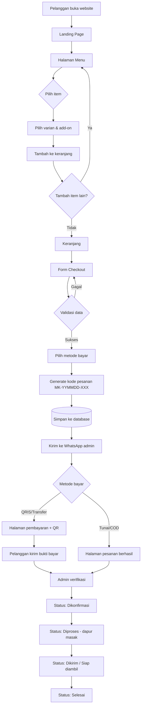

# 04 — Business Flow

Dokumen ini menjelaskan alur end-to-end dari pelanggan membuka website sampai
pesanan selesai diproses admin.

---

## 4.1 Alur utama (happy path)

```
[1] Pelanggan buka website
        ↓  (link dari bio Instagram / status WhatsApp / QR di booth)
[2] Landing page → lihat highlight menu
        ↓
[3] Halaman Menu → pilih kategori (Taichan / Minuman / ChocoBerry)
        ↓
[4] Pilih item → pilih varian (Small/Medium) → pilih add-on → atur jumlah
        ↓
[5] Tambah ke Keranjang  ────────┐
        ↓                        │ (bisa balik ke [3] untuk tambah item lain)
[6] Buka Keranjang ←───────────┘
        ↓  cek rincian & total
[7] Checkout → isi data (nama, WA, tipe order, alamat, waktu, catatan)
        ↓
[8] Pilih metode pembayaran (QRIS / Transfer / Tunai-COD)
        ↓
[9] Sistem buat kode pesanan  MK-YYMMDD-XXX
        ↓
[10] Simpan pesanan ke database (Fase 2)
        ↓
[11] Buka WhatsApp admin dengan pesan terstruktur otomatis
        ↓
[12] Halaman "Pesanan Berhasil" + instruksi pembayaran
        ↓
[13] Pelanggan bayar QRIS → kirim bukti ke WhatsApp
        ↓
[14] Admin verifikasi → ubah status "Dikonfirmasi"
        ↓
[15] Dapur memasak → status "Diproses"
        ↓
[16] Kurir antar / pelanggan ambil → status "Dikirim"
        ↓
[17] Pesanan diterima → status "Selesai"
```

---

## 4.2 Diagram alur (Mermaid)



---

## 4.3 Status pesanan (state machine)

| Status | Kode | Pemicu | Aksi berikutnya |
|---|---|---|---|
| Baru | `BARU` | Checkout selesai | Admin verifikasi pembayaran |
| Dikonfirmasi | `DIKONFIRMASI` | Pembayaran terverifikasi / COD disetujui | Kirim ke dapur |
| Diproses | `DIPROSES` | Dapur mulai memasak | Siapkan pengiriman |
| Dikirim | `DIKIRIM` | Kurir berangkat / pesanan siap diambil | Tunggu konfirmasi terima |
| Selesai | `SELESAI` | Pelanggan menerima pesanan | — |
| Batal | `BATAL` | Dibatalkan pelanggan/admin | — |

**Transisi yang diperbolehkan**

```
BARU         → DIKONFIRMASI | BATAL
DIKONFIRMASI → DIPROSES     | BATAL
DIPROSES     → DIKIRIM
DIKIRIM      → SELESAI
SELESAI      → (final)
BATAL        → (final)
```

> Aturan: setelah status `DIPROSES`, pesanan **tidak bisa** dibatalkan pelanggan (BR-07).

---

## 4.4 Alur alternatif & penanganan error

| Skenario | Penanganan |
|---|---|
| Keranjang kosong saat buka `/checkout` | Redirect ke `/menu` + pesan "Keranjang masih kosong" |
| Toko sedang tutup | Banner "Sedang Tutup" + checkout berubah jadi **Pre-order besok** |
| Menu habis saat masih di keranjang | Saat checkout, tampilkan peringatan & minta hapus item tersebut |
| Nomor WhatsApp tidak valid | Tampilkan error inline, blokir submit |
| Pelanggan tutup WhatsApp tanpa mengirim | Kode pesanan tetap ada; sediakan tombol "Kirim Ulang ke WhatsApp" |
| Pelanggan tidak bayar dalam 60 menit | Admin ubah status jadi `BATAL` (manual di Fase 2) |
| Alamat di luar jangkauan antar | Admin konfirmasi lewat WhatsApp & tawarkan ambil sendiri |
| Website error saat submit | Simpan keranjang di `localStorage`, tampilkan tombol coba lagi |

---

## 4.5 Alur sisi admin

```
Notifikasi WhatsApp masuk
        ↓
Buka /admin (login)
        ↓
Daftar pesanan (default filter: hari ini, status BARU)
        ↓
Buka detail pesanan → cek bukti bayar
        ↓
├─ Valid   → tombol "Konfirmasi"  → status DIKONFIRMASI
└─ Tidak   → tombol "Batalkan"    → status BATAL + hubungi pelanggan
        ↓
Cetak / catat ke dapur → status DIPROSES
        ↓
Serahkan ke kurir      → status DIKIRIM
        ↓
Pelanggan terima       → status SELESAI
        ↓
Akhir hari: buka Rekap Harian → jumlah pesanan + omzet
```

---

## 4.6 Format pesan WhatsApp (template resmi)

```
🍽️ *PESANAN BARU — MAU'S KITCHEN*
Kode Pesanan: *MK-260814-001*
📅 14 Agustus 2026, 19.45 WIB

👤 *DATA PEMESAN*
Nama    : Rizky
WhatsApp: 081234567890
Tipe    : Antar
Alamat  : Jl. Melati No. 12, RT 03/RW 05
Waktu   : Secepatnya

🛒 *RINCIAN PESANAN*
1. Taichan Daging
   2 porsi × Rp35.000 = Rp70.000
2. Choco Berry Grape (Medium)
   + Pistacio Kunava
   1 cup × Rp48.000 = Rp48.000
3. Thai Tea
   2 cup × Rp17.000 = Rp34.000
4. Lontong
   1 porsi × Rp5.000 = Rp5.000

Subtotal : Rp157.000
Ongkir   : dikonfirmasi admin
*TOTAL   : Rp157.000*

💳 *PEMBAYARAN*
Metode: QRIS (DANA / BCA / GoPay)
Status: Menunggu pembayaran

📝 *CATATAN*
Sambelnya pisah ya, jangan terlalu pedas

— Dikirim otomatis dari website MAU'S Kitchen
```

> Detail teknis encoding dan pembuatan deeplink ada di `13_WHATSAPP_INTEGRATION.md`.

---

## 4.7 SLA internal (target waktu)

| Tahap | Target waktu |
|---|---|
| Balas pesanan masuk | ≤ 5 menit (jam operasional) |
| Verifikasi pembayaran | ≤ 10 menit |
| Memasak Taichan | 15–20 menit |
| Menyiapkan Minuman / ChocoBerry | 5–10 menit |
| Pengiriman radius dekat | 15–30 menit |

---

➡️ Lanjut ke `05_MENU_CATALOG.md`
